### S1 Sign In
As soon as the student has logged into the system, he is redirected to a page with a list of courses available to him.

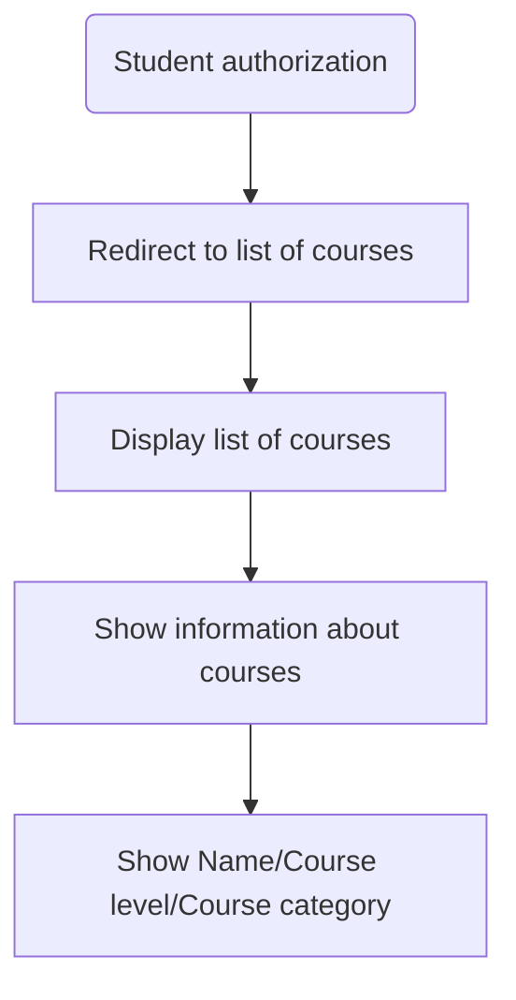
```mermaid
flowchart TD
    logIn("Student authorization") --> redirect["Redirect to list of courses"]
    redirect --> listOfCourses["Display list of courses"]
    listOfCourses --> showInfo["Show information about courses"]
    showInfo --> info["Show Name/Course level/Course category"]

```

### S2 Course Search
An authorized user can see the course search field on the top panel and can search for courses

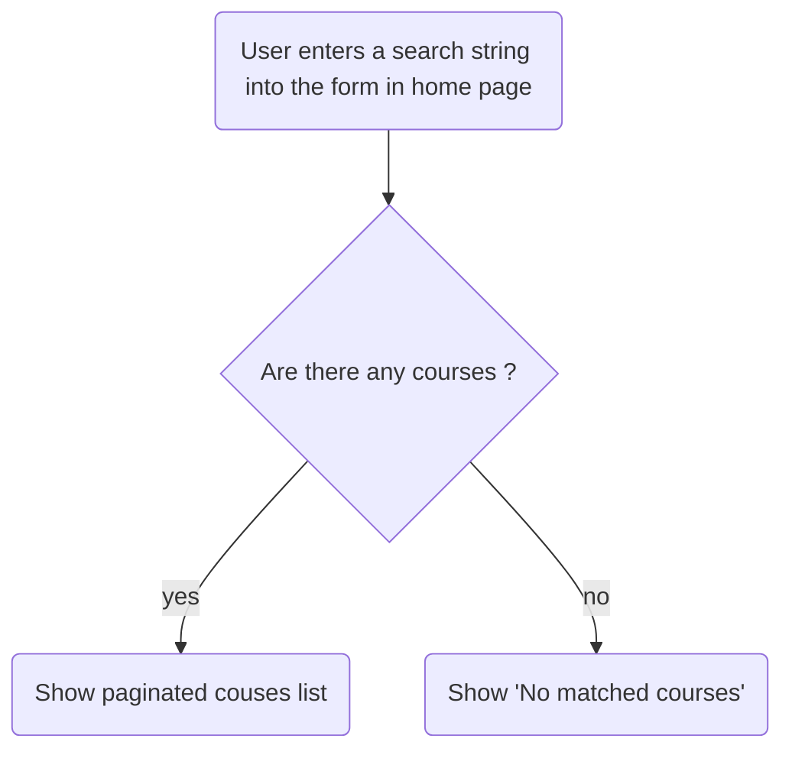
```mermaid
flowchart TD
    courseFindField(User enters a search string into the form in home page)
    courseFindField --> serverResponse{Are there any courses ?}
    serverResponse --yes --> showCourses(Show paginated couses list)
    serverResponse --no --> showEmptyMsg(Show 'No matched courses')
```

### S3 Get Course
Student can apply to the course he found.

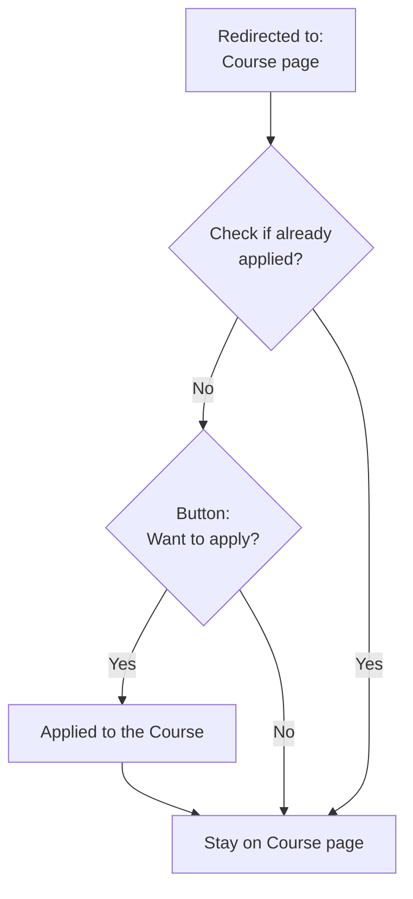
```mermaid
flowchart TD
    
    A[Redirected to: \nCourse page] --> B{Check if already \n applied?}
    B --> |No| D{Button: \nWant to apply?}
    D --> |Yes| E[Applied to the Course]
    D --> |No| F[Stay on Course page]
    B --> |Yes| F
    E --> F
```

### S4 Chat between student and mentor

Student has possibility to have a conversation with mentor about course or task

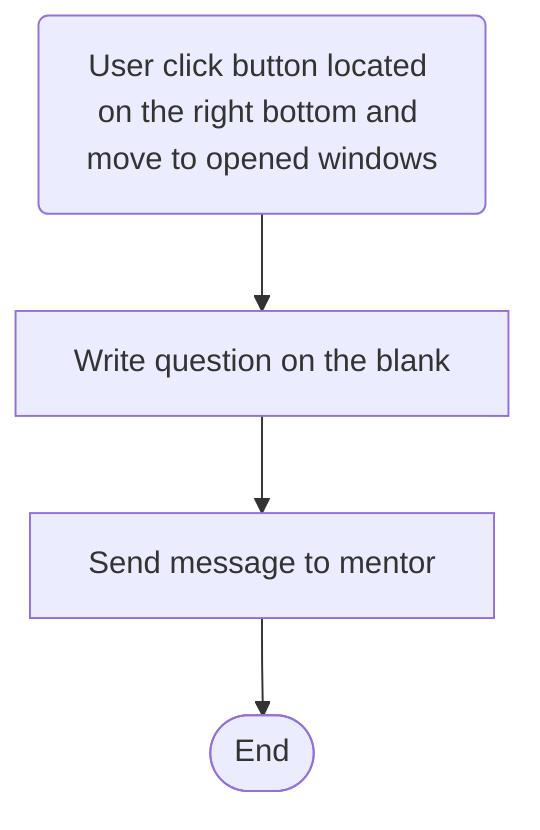
```mermaid
flowchart TD;
    End([End])

    moveToChatWindow(User click button located on the right bottom and move to opened windows)
    moveToChatWindow --> textMessage["Write question on the blank"]
    textMessage --> sendMessage["Send message to mentor"]
    sendMessage --> End
```

### S5 Rating of the compiled Lesson
A student after successfully completing a Lesson, a modal window with an option to evaluate the lesson with a text field for comment

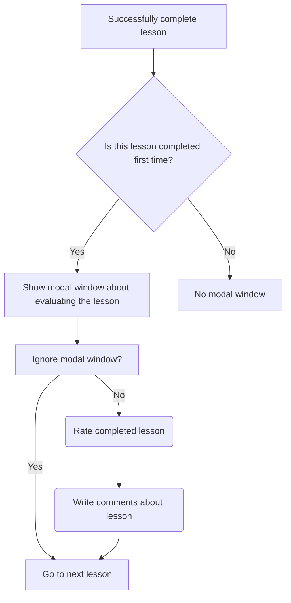
```mermaid
flowchart TD
    lesson["Successfully complete lesson"]--> isFirstTime{"Is this lesson completed first time?"}
    isFirstTime --Yes --> showWindow["Show modal window about evaluating the lesson"]
    showWindow --> ignore["Ignore modal window?"]
    ignore --No --> courseRate("Rate completed lesson")
    ignore --Yes --> finish
    courseRate --> courseComment("Write comments about lesson")
    isFirstTime --No --> ignoreWindow["No modal window"]
    courseComment --> finish["Go to next lesson"]

```

### S6 Course progress
Authorized student, on the course page can see the progress of the course, as well as when viewing all courses of the student, under each course should be visible progress

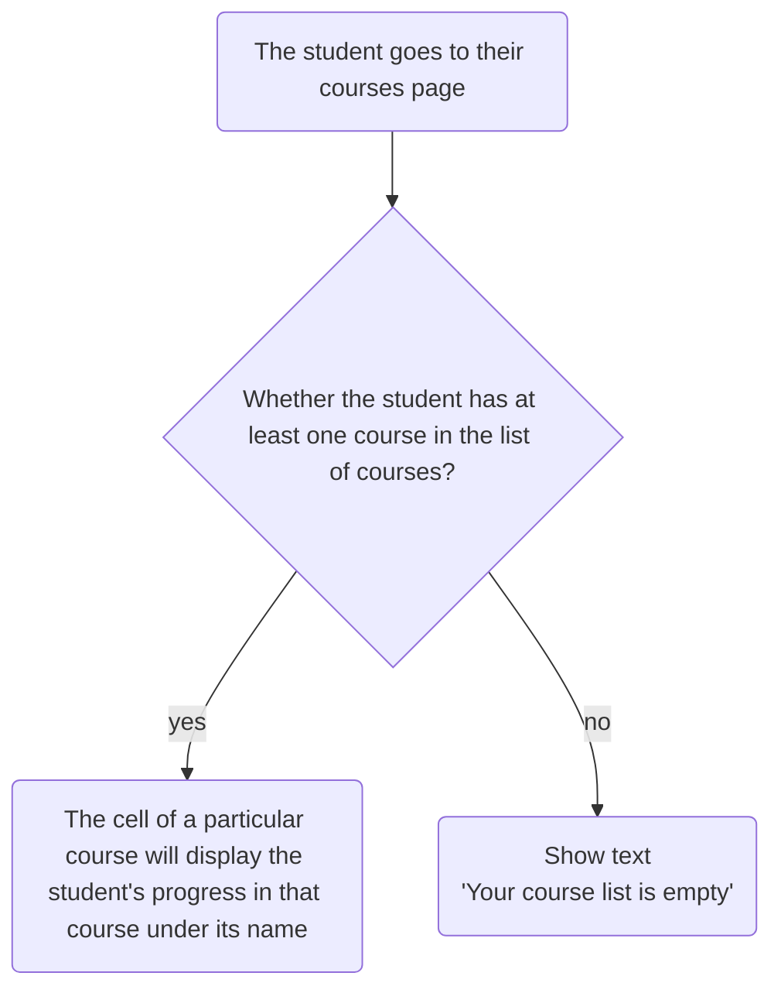
```mermaid
flowchart TD
    courseList(The student goes to their courses page)
    courseList --> isHasCourse{Whether the student has at least one course in the list of courses?}
    isHasCourse --yes -->showCourseProgress(The cell of a particular course will display the student's progress in that course under its name)
    isHasCourse --no --> showEmptyCourseListMsg(Show text \n'Your course list is empty')
```

### S7 Code review
Submitted code can be reviewed by Mentor and leave comments. 

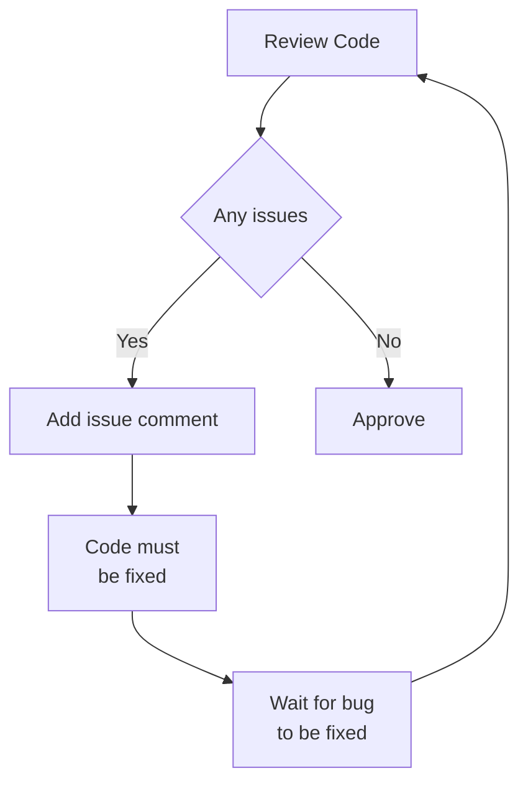
```mermaid
flowchart TD
    A[Review Code] --> B{Any issues}
    B --> |Yes| D[ Add issue comment]
    D --> E[Code must \nbe fixed]
    E --> F[Wait for bug \nto be fixed]
    B --> |No| C[Approve]
    F --> A
```

### S8 Student possibility to see feedback and mark of his task solution

Student has possibility to see feedback and mark for his solution of task

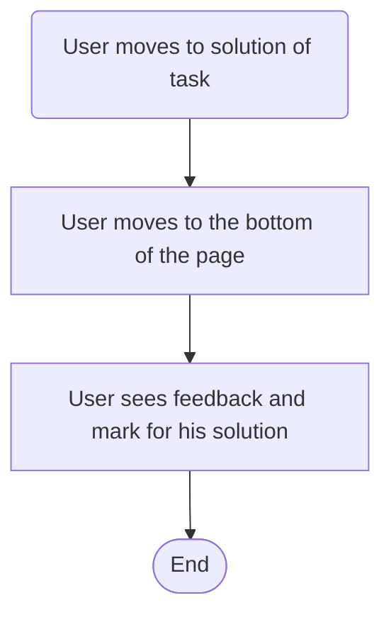
```mermaid
flowchart TD;
    End([End])

    moveToCurrentSolution("User moves to solution of task")
    moveToCurrentSolution --> moveToEndOfPage["User moves to the bottom of the page"]
    moveToEndOfPage --> seeFeedback["User sees feedback and mark for his solution"]
    seeFeedback --> End
```

### S9 Additional materials access
Each course participant on the main page of the course has a list of additional materials for this course, and on the page of a specific lesson there is material (links, files, source code) that relates to this lesson

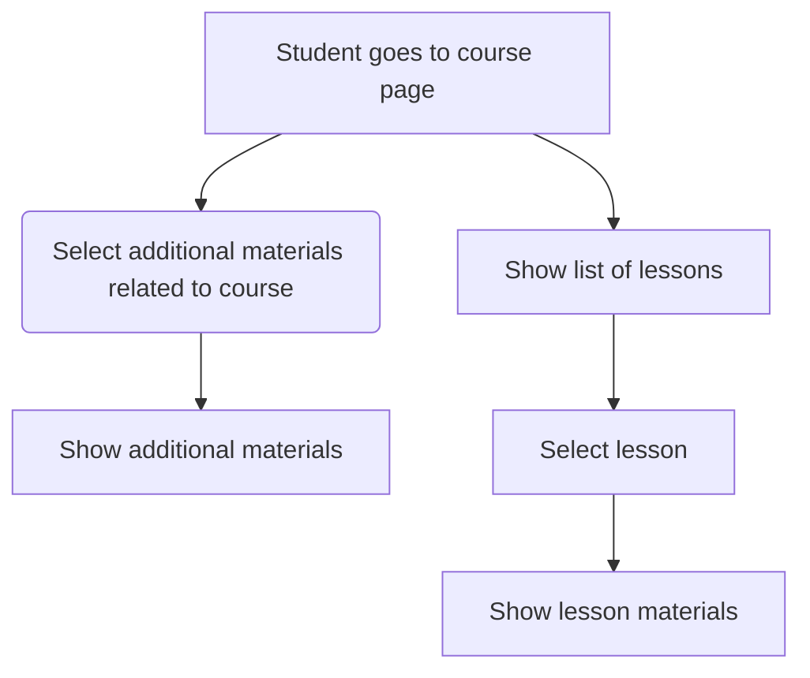
```mermaid
flowchart TD;
    coursePage["Student goes to course page"] --> selectMaterial("Select additional materials related to course")
    selectMaterial --> showMaterial["Show additional materials"]
    coursePage --> showLessons["Show list of lessons"]
    showLessons --> lessonPage["Select lesson"]
    lessonPage --> accessToMaterial["Show lesson materials"]

```

### S10 Attach files/links to homework assignments
Student has the option to submit different files and links under the homework assignment

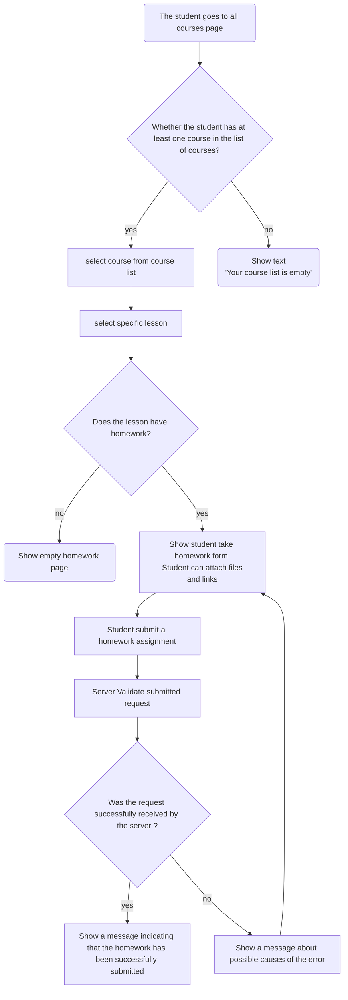
```mermaid
flowchart TD
    courseList(The student goes to all courses page)
    courseList --> isHasCourse{"`Whether the student has at least one course in the list of courses?`"}
    isHasCourse --yes --> selectCourse[select course from course list] 
    selectCourse --> selectLesson[select specific lesson] --> isHasLessonHomework{Does the lesson have homework?}
    isHasLessonHomework -- no --> showEmptyHWMsg(Show empty homework page) 

    isHasLessonHomework -- yes --> userAttachHW[Show student take homework form \n Student can attach files and links]
    userAttachHW --> userSendHW[Student submit a homework assignment] --> serverValidateHW[Server Validate submitted request] 
    serverValidateHW --> isHWAccepted{"`Was the request successfully received by the server ?`"}
    isHWAccepted -- yes --> showSuccessMgs["`Show a message indicating that the homework has been successfully submitted`"]
    isHWAccepted -- no --> showHelpMgs["`Show a message about possible causes of the error`"] --> userAttachHW
    
    isHasCourse --no --> showEmptyCourseListMsg(Show text \n'Your course list is empty')

```

### S11 Update lesson  
Ability to leave a reqeust to fix the course if student found typo or irrelevant information. 

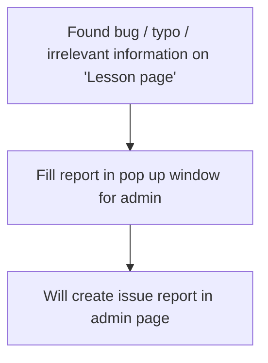
```mermaid
flowchart
    A[Found bug / typo / \nirrelevant information on 'Lesson page'] --> B[Fill report in pop up window for admin]
    B --> C[Will create issue report in admin page]
```

### S12 Ability for unauthorized users to left a feedback to mentor

Unauthorized user has ability to left a feedback to any of mentors

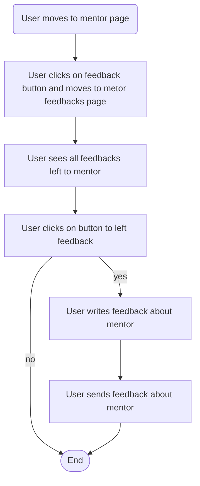
```mermaid
flowchart TD;
    End([End])

    moveToMentorPage("User moves to mentor page")
    moveToMentorPage --> moveToFeedbackPage["User clicks on feedback button and moves to metor feedbacks page"]
    moveToFeedbackPage --> seeMentorFeedback["User sees all feedbacks left to mentor"]
    seeMentorFeedback --> clickButtonToLeftFeedback["User clicks on button to left feedback"]
    clickButtonToLeftFeedback --yes --> writeFeedback["User writes feedback about mentor"]
    clickButtonToLeftFeedback --no --> End
    writeFeedback --> sendFeedback["User sends feedback about mentor"]
    sendFeedback --> End
```

### S13 Course survey option
There should be a button (option) on the main page of the course that allows students to choose available surveys in the course, and all trainees in this course should be able to vote on topics in this survey

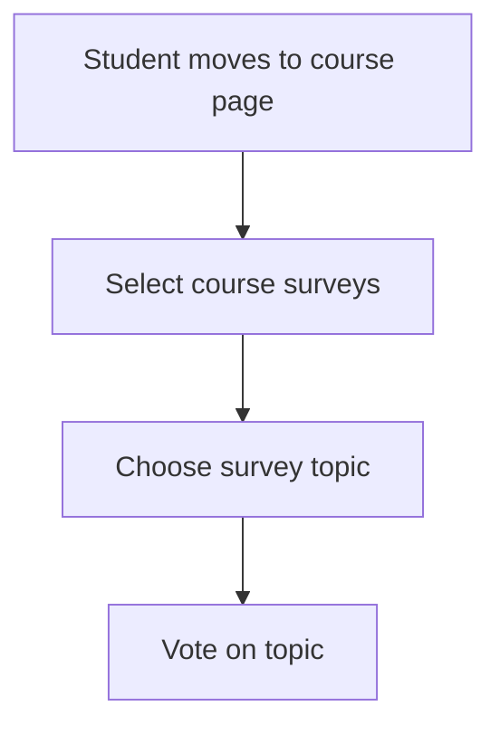
```mermaid
flowchart TD
    coursePage["Student moves to course page"] -->  courseMainPage
    courseMainPage["Select course surveys"] --> viewSurvey["Choose survey topic"] 
    viewSurvey --> vote["Vote on topic"]
    
```

### S14 Variety of tasks
Students can have different variations of assignments after the lesson(tests/coding)

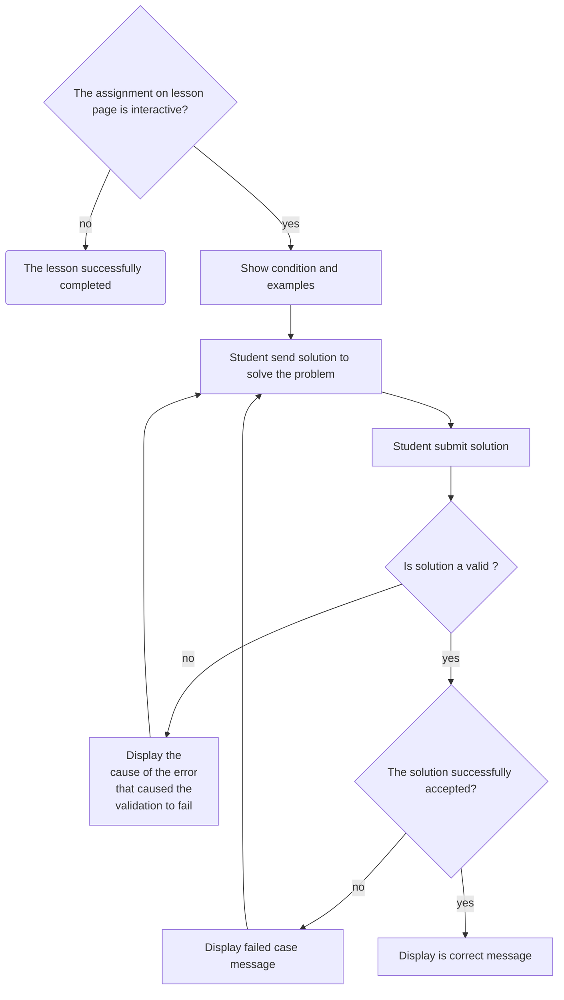
```mermaid
flowchart TD
    mentorSelectInteractive{"The assignment on lesson page is interactive?"}
    mentorSelectInteractive -- no --> showLessonSucComplete("The lesson successfully  completed") 
    mentorSelectInteractive -- yes --> takeInteractiveLesson[Show condition and examples] --> studentWriteSol[Student send solution to solve the problem]
    
    studentWriteSol --> submitCode[Student submit solution] --> isSolutionValid{Is solution a valid ?}
    
    isSolutionValid -- no --> showInvalidMsg["Display the\n cause of the error\n that caused the\n validation to fail"] --> studentWriteSol
    isSolutionValid -- yes --> solutionIsCorrect{The solution successfully accepted?}
    solutionIsCorrect -- no --> showFailedTestCase["Display failed case message"] --> studentWriteSol
    solutionIsCorrect -- yes --> showSuccessMsg["Display is correct  message "]

```

### S15 Student feedback
Student can check in his profile if there is a feedback about him/her from Mentor or Manager.

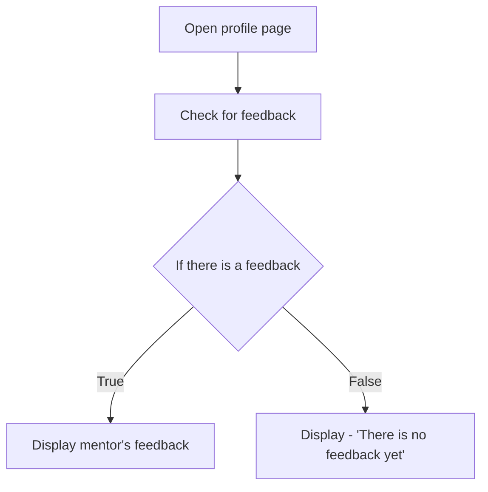
```mermaid
flowchart TD
    A[Open profile page] --> B[Check for feedback]
    B --> C{If there is a feedback}
    C --> |True| D[Display mentor's feedback]
    C --> |False| E[Display - 'There is no feedback yet']
    
```

### S16 Student ability to chat with other students

Student has ability to communicate with other students in common chat

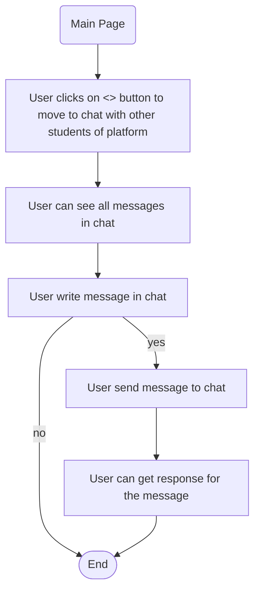
```mermaid
flowchart TD;
    End([End])

    mainPage("Main Page")
    mainPage --> moveToChat["User clicks on <<COMMUMINTY>> button to move to chat with other students of platform"]
    moveToChat --> seeChat["User can see all messages in chat"]
    seeChat --> writeMessage["User write message in chat"]
    writeMessage --yes --> sendMessage["User send message to chat"]
    writeMessage --no --> End
    sendMessage --> getMessage["User can get response for the message"]
    getMessage --> End
```

### M1 Course creating by mentors
For authorized mentors in the left tab of the main page we have button "my courses (mentor)" by clicking on this button we go to a page with all courses where this user is a mentor and on this page there is a button "create a course" clicking on this button takes you to the creation page course with the fields that are needed to create a course, as well as a “save” button to create the course that we described, the created course is added to the list of courses where this user is a mentor, clicking on a specific course opens a page with this course, in which we can change course (add lessons, surveys, assignments)

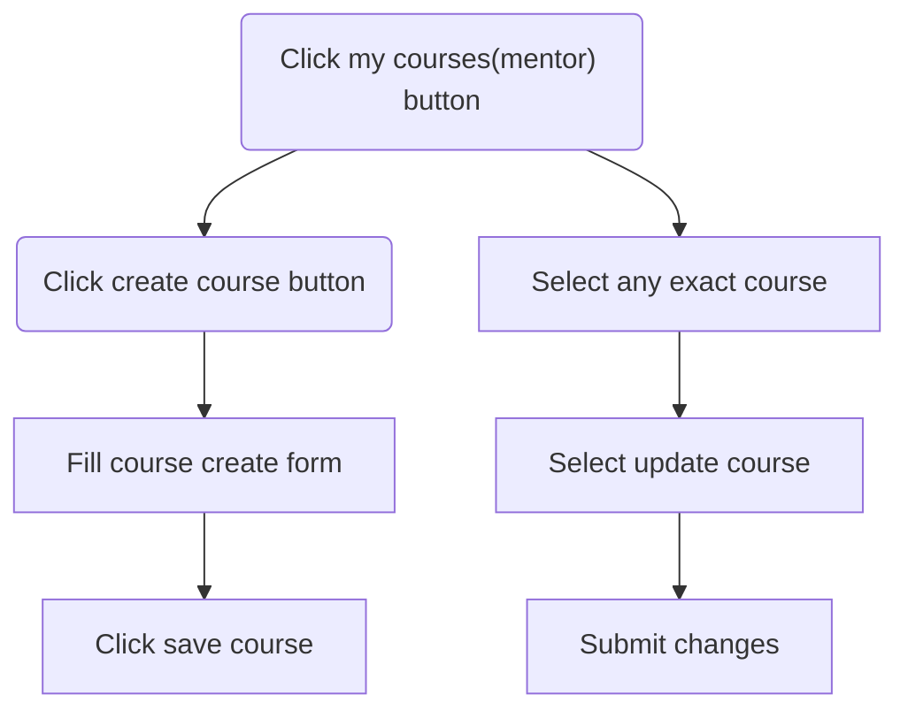
```mermaid
flowchart TD
    myCourses("Click my courses(mentor) button") --> createCourse("Click create course button")
    createCourse --> createForm
    myCourses --> selectAnyCourse["Select any exact course"]
    selectAnyCourse --> updateCourse["Select update course"]
    updateCourse --> submitChange["Submit changes"]
    createForm["Fill course create form"] --> saveCourse["Click save course"]

```

### M2 Auto check code compliance with best practice
Automatically checks if the code conforms to some "best practice" and notifies the student if it does not.

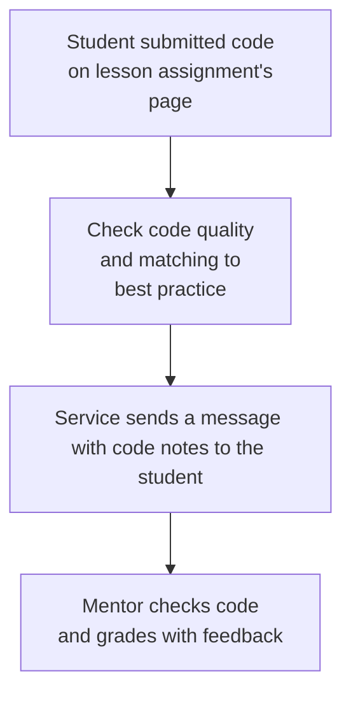
```mermaid
flowchart TD
    studentCode[Student submitted code\n on lesson assignment's page]
    studentCode --> checkByService[Check code quality\n and matching to\n best practice]
    checkByService --> sendNotification[Service sends a message with code notes to the student]
    sendNotification --> mentorFeedback[Mentor checks code\n and grades with feedback]
```

### M3 Add links to lesson
While creating a lesson Mentor can leave links as additional study material.

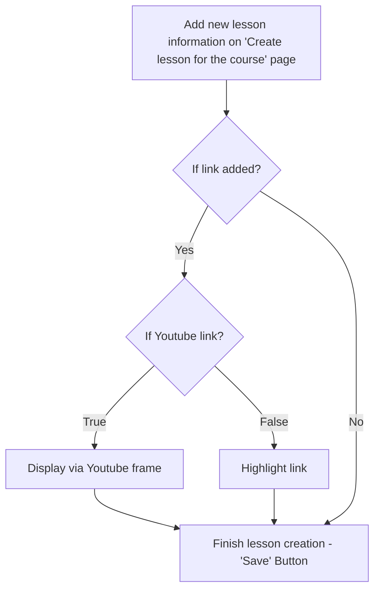
```mermaid
flowchart TD
    A[Add new lesson information on 'Create lesson for the course' page] --> B
    B{If link added?} --> |Yes|C
    C{If Youtube link?} --> |True| E[Display via Youtube frame]
    C --> |False| D[Highlight link]
    E --> End[Finish lesson creation - 'Save' Button]
    D --> End
    B --> |No| End

```

### M4 Student ability to chat with other students

Student has ability to filter courses by level

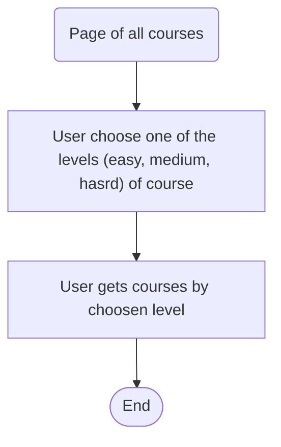
```mermaid
flowchart TD;
    End([End])

    coursePage("Page of all courses")
    coursePage --> selectLevel["User choose one of the levels (easy, medium, hasrd) of course"]
    selectLevel --> filterCourses["User gets courses by choosen level"]
    filterCourses --> End
```

### M5 Awarding students with points
A user authorized as a mentor can go to the page of the course he created, this page has a students tab, clicking on this tab opens a list of students, next to the information about the student (name) there is a special form for awarding points to the student

```mermaid
flowchart TD
    myCourses("Click on student tab on courses page") --> showStudentList("Click list of students")
    showStudentList --> studentSelect["Select student"]
    studentSelect --> showAwardForm["Show form for awarding student"]
    showAwardForm --> awardStudent["Award student"]

```

### M6 Student's rating
The student has a rating on his/her profile based on the grades he/she received in the courses

```mermaid
flowchart TD
    studentPage[Mentor goes to the student page]
    studentPage --> selectLesson[Mentor selects a specific lesson from the course]
    selectLesson --> gradeStudent["Mentor evaluates student(s) under this lesson"]
    gradeStudent
```

### M7 Get Student statistics
Mentor can see the progress of the Student by passed tests, quizzes and course progress.

```mermaid
flowchart TD
    A[Check student statistics on 'Student profile' page] --> B{If statistics}
    B --> |Yes| C[Filter data by passed \ntests / quizzes, progress]
    B --> |No| D[Display 'Student haven't completed anything yet']
    
```

### M8 JS Editor with highlighting code

Student has ability to filter courses by level

```mermaid
flowchart TD;
    End([End])

    startUsingEditor("User start using editor")
    startUsingEditor --> writeCode["User writes or paste code in editor"]
    writeCode --> highlightSyntaxError["Highlight syntax error"]
    highlightSyntaxError --> yes --> correctSyntaxError["User make right the syntax in written code"]
    highlightSyntaxError --> no --> runCode["User run code"]
    correctSyntaxError --> highlightSyntaxError
    runCode --> getResult["User gets result"]
    getResult --> End
```

### M9 Leave comment about lesson, Chat option from mentors side
On the lesson page, under all the material for the lesson, there should be a form in which the trainee can write a comment about lesson, and the mentor can also respond to this comment; Chat implementation: A user authorized as a mentor can go to a specific course and go to the student list tab by clicking on the student’s username to view information about the student, and on this page there should be a “write” button, clicking on this button opens a page with a form in which you can print a message and send and the history of correspondence, after the initial exchange of a message, the correspondence should be displayed on the “CHAT” page, which can be accessed through the navigation on the user’s main page

```mermaid
flowchart TD
    logIn("Log in") --> studentGoLesson["Student go to lesson's page"]
    logIn --> mentor["Open mentor's page"]
    studentGoLesson--> goToLesson["Go end of the lesson"]
    goToLesson --> leaveComment("Comment about lesson")
    mentor --> commentRespond["Respond to comment in lesson"]
    commentRespond --> leaveComment
    mentor --> courseSelect["Select course"]
    mentor --> chat(["Chat"])
    courseSelect --> showCoursePage["Show course page"]
    showCoursePage --> listOfStudents["Click list of students"]
    listOfStudents --> studentSelect["Select student"]
    studentSelect --> aboutButton["Click About student button"]
    aboutButton --> writeMessage["Click write message"]
    writeMessage --> write["Write message"]
    write --> sendMessage["Send"]
    chat --> displayMessages["Display messages"]
    sendMessage --> displayMessages

```

### M10 Extra Courses
Students should have the opportunity to take additional courses

```mermaid
flowchart TD
    courseList["The student goes to\n their courses page"]
    courseList --> selectOptional["The student has\n selected optional courses"]
    selectOptional --> showOptinalCourses["Display paginated\n list of optional courses"]
    showOptinalCourses --> searchCourse["Find the course\n using a form in header"]
    searchCourse --> displayCourse["Redirect to course main page"]
    displayCourse --> isCourseAlreadyApplied["Is course already applied"]
    isCourseAlreadyApplied -- yes --> displayAppliedMsg[Display message\n 'You are already applied']
    isCourseAlreadyApplied -- no --> applyToCourse[Apply to Course]
```

### M11 Interactive Courses
To make course diverse, Mentor can assign different types of tasks: codding, tests, quizzes

```mermaid
flowchart TD
    A[Complete lesson] --> B{If task / quiz / coding}
    B --> |Yes| C[Take task/quiz/coding]
    B --> |No| D[Next Lesson]
    C --> E[\Result\]
    E --> F{Retake task/quiz ?}
    F --> G[Yes]
    G --> C
    F --> H[No]
    H --> D
    
```

### M12 Send notification

Notification is created after leaving comment or sending message by mentor

```mermaid
flowchart TD;
    End([End])

    mentor("Mentor")
    mentor --> sendMessage["Send message to User in chat"]
    mentor --> leaveComment["Leave comment for student's solution"]
    sendMessage --> createNotification["Creating notification"]
    leaveComment --> createNotification["Creating notification"]
    createNotification --> sendNotification["Send created notification to email/telegram account"]
    sendNotification --> End

```

### M13 Fixing reported issue
Ability to fix the course if student found typo or irrelevant information and reported it. 

```mermaid
flowchart
    A[Issue report in Admin page]
    A --> B[Review the issue]
    B --> C{Is there something to fix?}
    C --> |Yes| D[Fix issue]
    C --> |No| E[Decline Fix]
    D --> F[Report to Student]
    E --> F

```